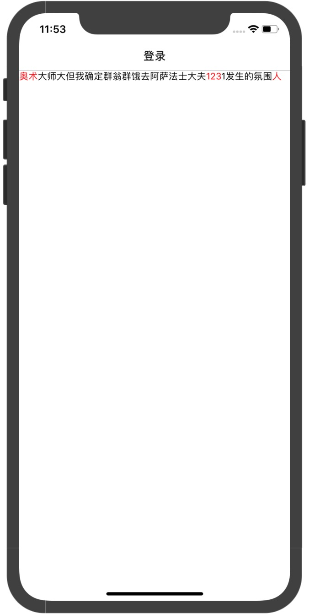

# react-native-wxkeywordtext
## [English.md](./README.en.md)
## 说明
一个提取关键字的text

## 集成方式

### 为你的项目添加本库,无需link
`$ npm install react-native-wxkeywordtext --save`
或
`yarn add react-native-WXKeyWordText`


## 用法
### RN中
```
//引入WXKeyWordText
import {WXKeyWordText} from 'react-native-wxkeywordtext';

		<WXKeyWordText
			//默认的大段文字
                    text={"奥术大师大但我确定群翁群饿去阿萨法士大夫1231发生的氛围人"}
			//需要提取的关键字
                    keyWords={["奥术", "123", "人"]}
			//需要提取的关键字的文字样式
                    keyWordStyle={{color:"red"}}
			//默认文字样式
		    textStyle={{color:"black"}}
                />

```


## iOS图示
